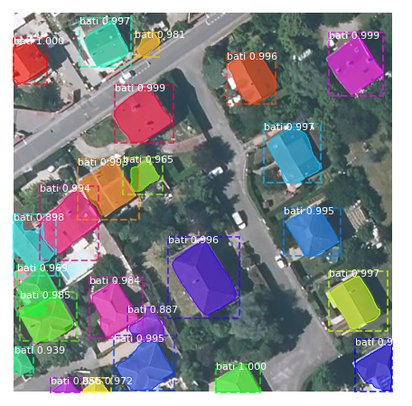

# Mask R-CNN for building footprint Detection and Segmentation

This is an implementation of [Mask R-CNN](https://arxiv.org/abs/1703.06870) on Python 3, Keras, and TensorFlow adapted from the Mask RCNN tensorflow implementation available: [https://github.com/matterport/Mask_RCNN](https://github.com/matterport/Mask_RCNN). The model generates bounding boxes and segmentation masks for each instance of an object in the image. It's based on Feature Pyramid Network (FPN) and a ResNet101 backbone.
The following figure shows an example of the building footprint detection.

